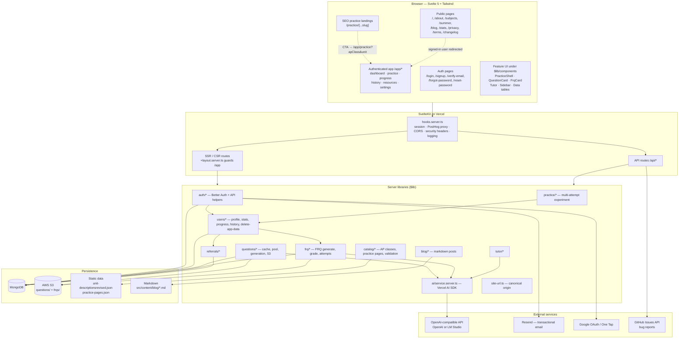
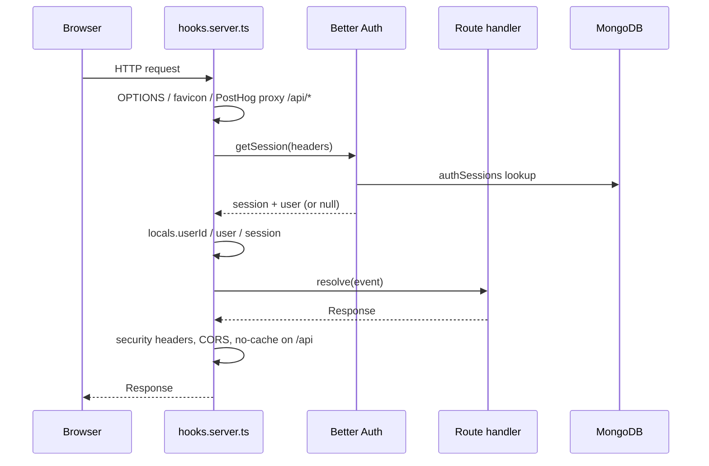
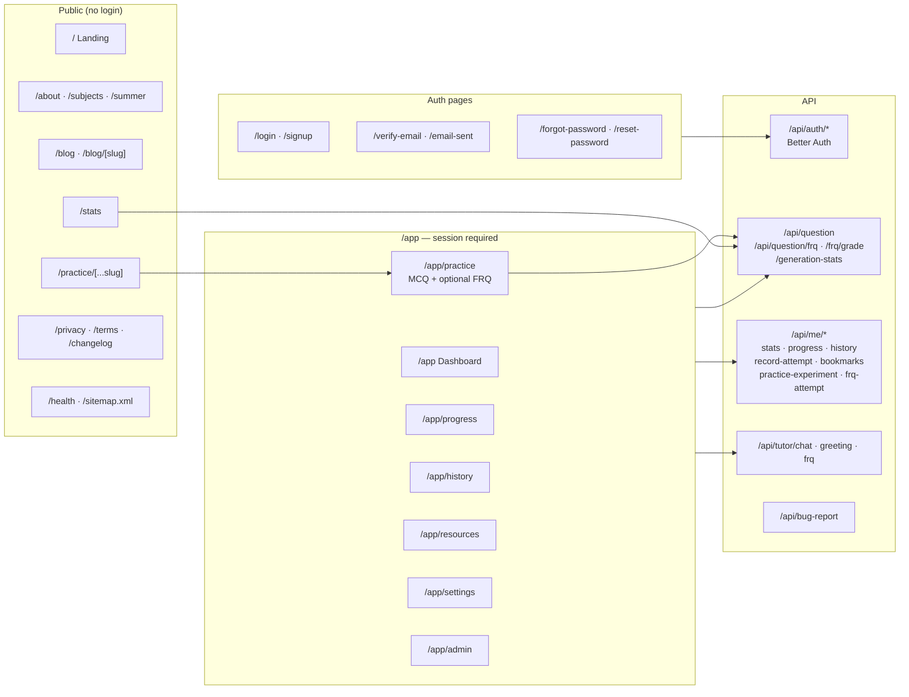
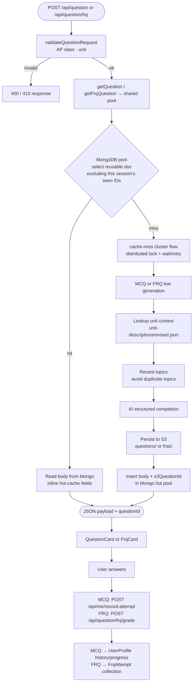
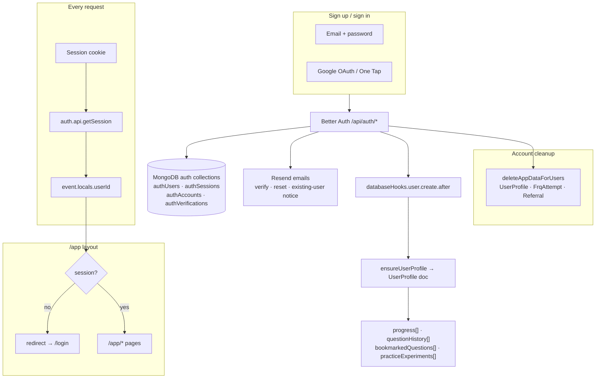
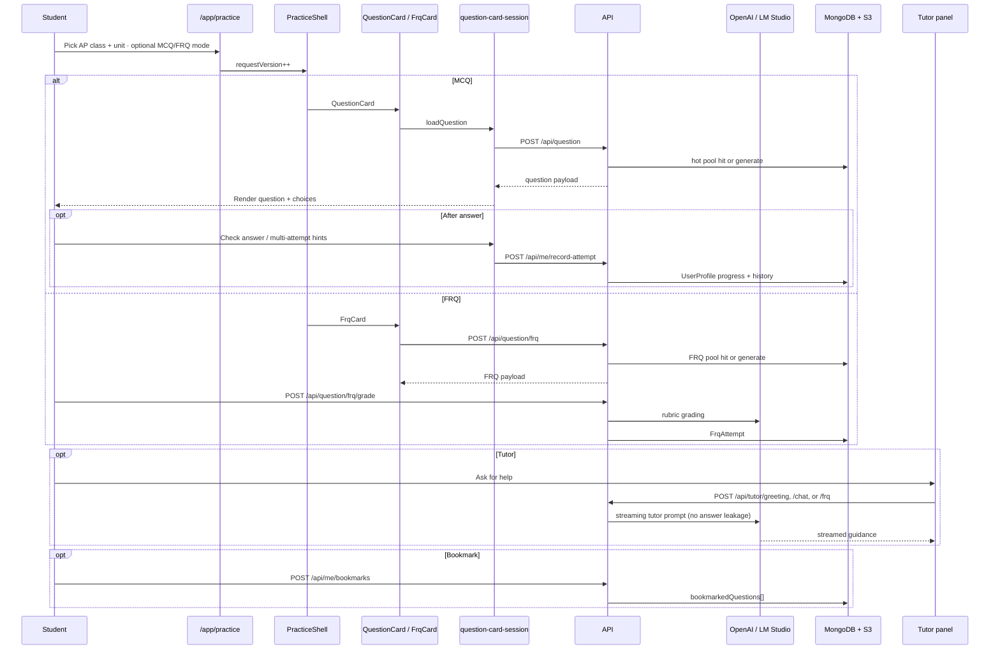

# Free AP Practice — Architecture

High-level overview of how the app is structured, how requests flow, and how the main features connect.

---

## 1. System overview



---

## 2. Request lifecycle (every HTTP request)



---

## 3. Route map



Public SEO landings use `QuestionShell` (MCQ-only thin wrapper over `PracticeShell`). Authenticated `/app/practice` uses `PracticeShell` with `allowFrq` when the FRQ flag is on.

---

## 4. Question generation pipeline (core feature)

MCQ and FRQ share the same hot-pool / cache-miss machinery (`createQuestionPool` + cluster lock). Bodies live under S3 prefixes `questions/` and `frqs/`.



**Pool behavior notes**

- Signed-in and anonymous users share the same reusable Mongo hot pool (per question type).
- The browser sends current-session `excludeQuestionIds` for standard questions so one session does not see the same question ID twice.
- Multiple users can receive the same cached question at the same time; cached docs are not claimed, locked, or deleted after a serve count.
- `contentHash` (SHA-256 of normalized question text) deduplicates entries **inside the hot pool** only — it prevents the same MCQ body from being inserted twice during generation.
- On a standard-unit miss, `CacheMissLock` coordinates one live generation across Vercel serverless instances. Ops script: `bun scripts/clear-cache.ts`.

There is **no** application-level AI rate limiter on `/api/question` or `/api/tutor/chat` after the process-local / Upstash experiments were removed. Cost and abuse controls, if needed again, should be added deliberately (edge/WAF or a shared store), not as process-local maps.

---

## 5. Authentication and user profile



Canonical site origin for emails, sitemaps, and discovery lives in `$lib/site-url.ts`. Auth callbacks use `$lib/auth/urls.ts` (`authCallbackUrl`). Authenticated API routes use `withAuthedHandler` in `$lib/auth/route-helpers.server.ts`.

---

## 6. Practice session (signed-in user journey)



`QuestionShell` is a thin public MCQ-only wrapper around `PracticeShell`. MCQ answer/load/experiment state lives in `createQuestionCardSession` (`question-card-session.svelte.ts`); markup stays in `question-card.svelte`.

`$lib/practice/*` is the **multi-attempt A/B experiment**, not practice routing. Practice page catalog + SEO live in `$lib/catalog` and `$lib/components/practice`.

---

## 7. Data model (MongoDB)

```mermaid
erDiagram
    AUTH_USERS ||--o{ AUTH_SESSIONS : has
    AUTH_USERS ||--o{ AUTH_ACCOUNTS : has
    AUTH_USERS ||--|| USER_PROFILE : "1:1 via userId"
    AUTH_USERS ||--o{ FRQ_ATTEMPT : has
    AUTH_USERS ||--o{ REFERRAL : "referrer or referred"

    USER_PROFILE {
        string userId PK
        array progress
        array questionHistory
        array bookmarkedQuestions
        array practiceExperiments
    }

    FRQ_ATTEMPT {
        string userId
        string questionId
        string status
        object grade
    }

    REFERRAL {
        string referrerUserId
        string referredUserId
        string code
    }

    QUESTION_POOL {
        string s3QuestionId UK
        string apClass
        string unit
        string contentHash UK
        string question
    }

    CACHE_MISS_LOCK {
        string key UK
        date expiresAt
    }

    QUESTION_RECENT_TOPICS {
        string apClass
        string unit
        string topicsCovered
    }

    GEN_STATS {
        counters for public /stats
    }

    QUESTION_POOL }o--|| S3_OBJECT : "s3QuestionId from generation"
    USER_PROFILE }o--o{ S3_OBJECT : "history references questionId"
    FRQ_ATTEMPT }o--o{ S3_OBJECT : "FRQ questionId"
```

---

## How the pieces fit together

| Layer              | Role                                                                                                                                                                   |
| ------------------ | ---------------------------------------------------------------------------------------------------------------------------------------------------------------------- |
| **Public site**    | Marketing, blog, SEO practice pages, and generation stats — mostly static or read-only                                                                                 |
| **/app**           | Core product: MCQ (+ optional FRQ) practice, progress, history, bookmarks, settings                                                                                    |
| **Question cache** | Shared pool for MCQ and FRQ: one generation writes S3 once, then stores body + `s3QuestionId` in Mongo; `CacheMissLock` coordinates misses across serverless instances |
| **Better Auth**    | Sessions, OAuth, email verification; creates `UserProfile` on signup; `deleteAppDataForUsers` cleans app rows on account delete                                        |
| **AI layer**       | One OpenAI-compatible provider for generation, FRQ grading, and tutor chat                                                                                             |
| **Referrals**      | Invite cookie → claim → activate on first meaningful attempt                                                                                                           |
| **Vercel**         | Hosting, `waitUntil` for background auth tasks, optional Analytics/Speed Insights                                                                                      |
