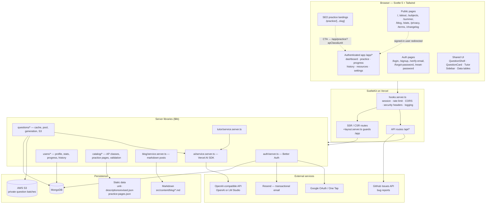
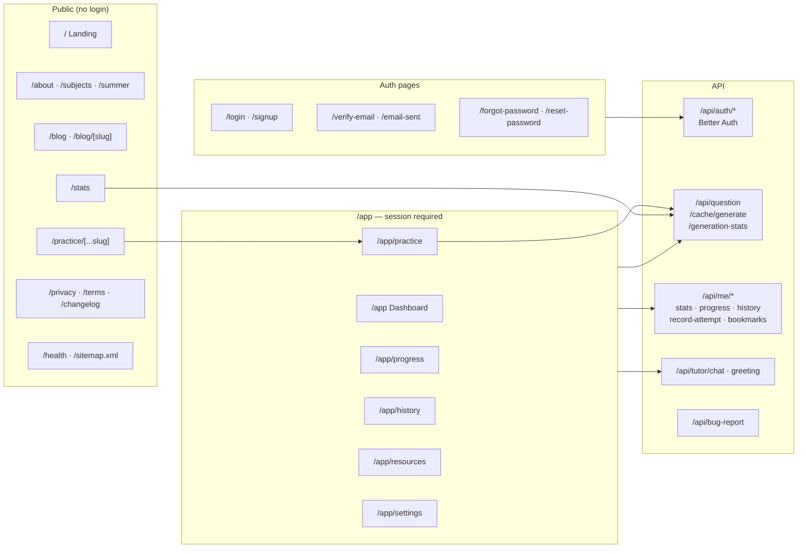
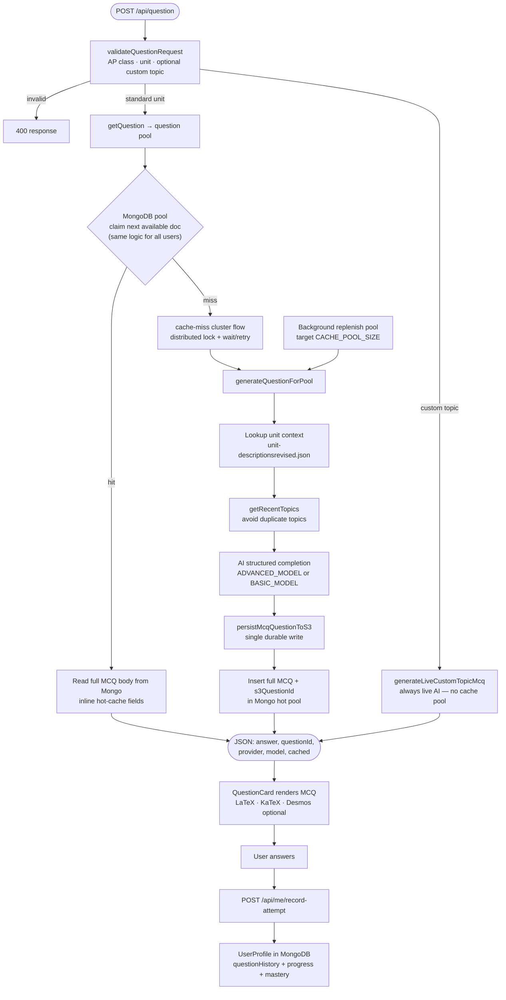
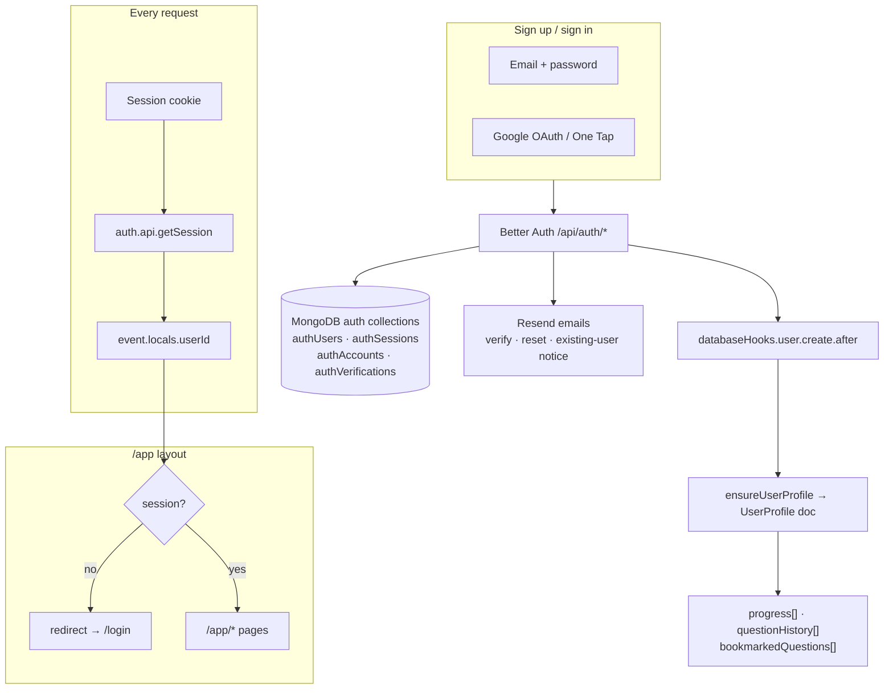
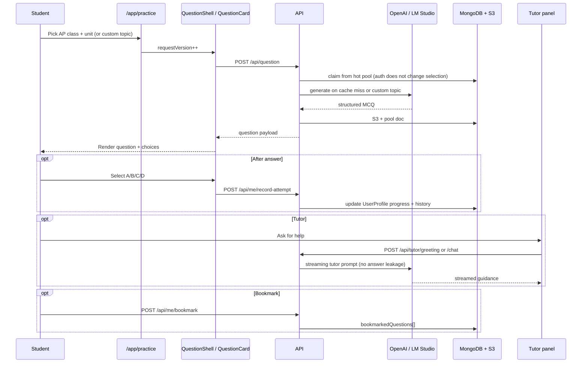

# Free AP Practice — Architecture

High-level overview of how the app is structured, how requests flow, and how the main features connect.

---

## 1. System overview




---

## 2. Request lifecycle (every HTTP request)


---

## 3. Route map




---

## 4. Question generation pipeline (core feature)




**Pool behavior notes**

- Signed-in and anonymous users share the same claim path: oldest available doc for `(apClass, unit)` by `lastServedAt`, with no per-user repeat filtering.
- `contentHash` (SHA-256 of normalized question text) deduplicates entries **inside the hot pool** only — it prevents the same MCQ body from being inserted twice while replenishing.
- Pool docs are ephemeral: after `maxServeCount` serves (default 50), the Mongo doc is deleted. S3 remains the durable copy for history and bookmarks.
- Background replenish targets `CACHE_POOL_SIZE` per class/unit bucket. Ops scripts: `pnpm cache:clear`, `pnpm cache:warm`.

---

## 5. Authentication and user profile




---

## 6. Practice session (signed-in user journey)




---

## 7. Data model (MongoDB)

```mermaid
erDiagram
    AUTH_USERS ||--o{ AUTH_SESSIONS : has
    AUTH_USERS ||--o{ AUTH_ACCOUNTS : has
    AUTH_USERS ||--|| USER_PROFILE : "1:1 via userId"

    USER_PROFILE {
        string userId PK
        array progress
        array questionHistory
        array bookmarkedQuestions
    }

    QUESTION_POOL {
        string s3QuestionId UK
        string apClass
        string unit
        string contentHash UK
        string question
        string status
        int serveCount
        int maxServeCount
    }

    CACHE_MISS_LOCK {
        string key UK
        date expiresAt
    }

    QUESTION_RECENT_TOPICS {
        string apClass
        string unit
        string topicsCovered
    }

    GEN_STATS {
        counters for public /stats
    }

    QUESTION_POOL }o--|| S3_OBJECT : "s3QuestionId from generation"
    USER_PROFILE }o--o{ S3_OBJECT : "history references questionId"
```


---

## How the pieces fit together


| Layer              | Role                                                                                                                                                                                                                                                                |
| ------------------ | ------------------------------------------------------------------------------------------------------------------------------------------------------------------------------------------------------------------------------------------------------------------- |
| **Public site**    | Marketing, blog, SEO practice pages, and generation stats — mostly static or read-only                                                                                                                                                                              |
| `**/app`**         | Core product: generate questions, track progress, history, bookmarks, settings                                                                                                                                                                                      |
| **Question cache** | One generation path writes S3 once, then stores full MCQ bodies plus `s3QuestionId` in the Mongo hot pool; serves read Mongo only. Pool-level `contentHash` dedup; no per-user seen tracking. `CacheMissLock` coordinates cache misses across serverless instances. |
| **Better Auth**    | Sessions, OAuth, email verification; creates a `UserProfile` on signup                                                                                                                                                                                              |
| **AI layer**       | One OpenAI-compatible provider (cloud or LM Studio) for generation, grading context, and tutor chat                                                                                                                                                                 |
| **Vercel**         | Hosting, `waitUntil` for background auth tasks, optional Analytics/Speed Insights                                                                                                                                                                                   |

