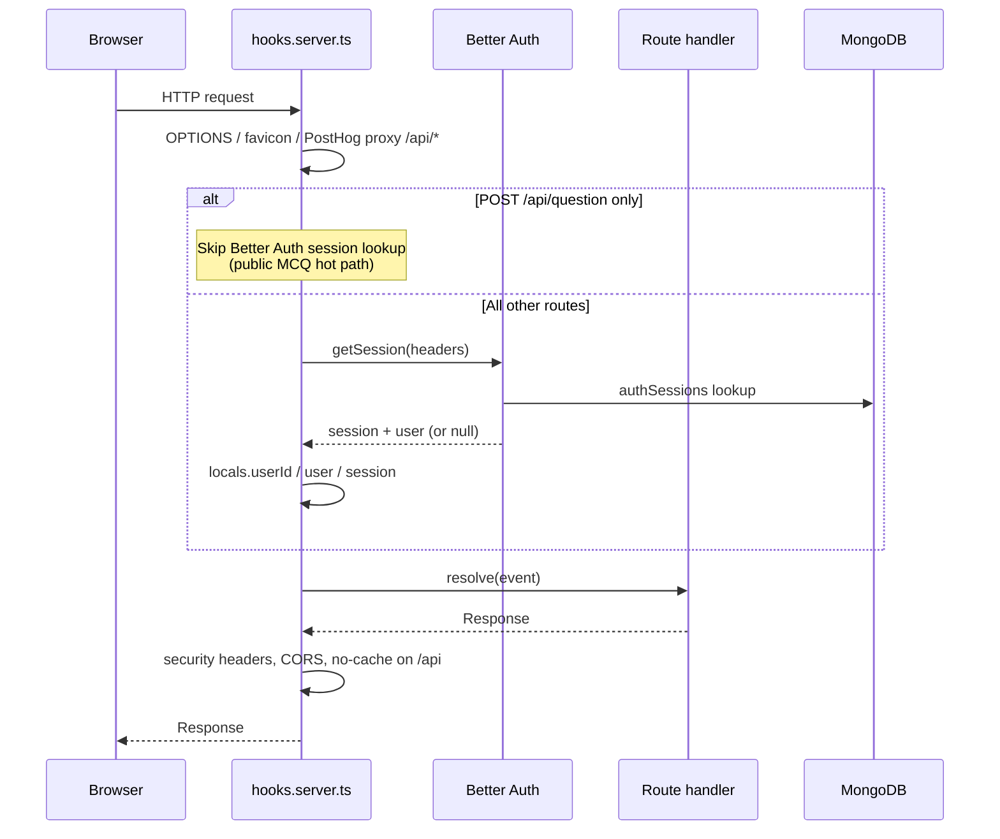
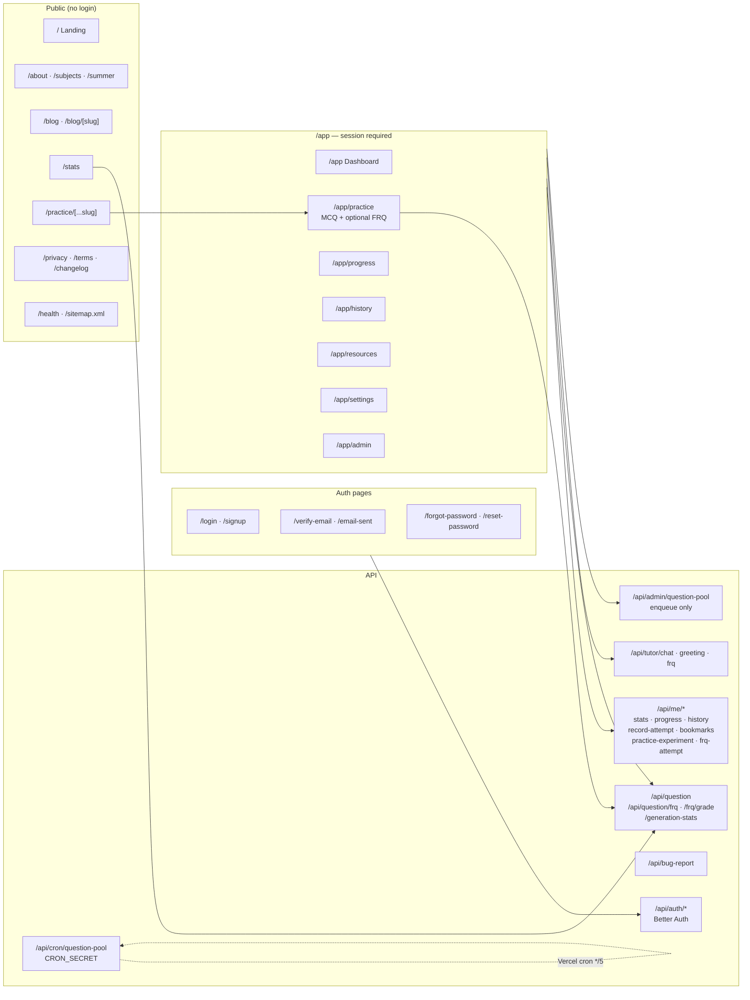
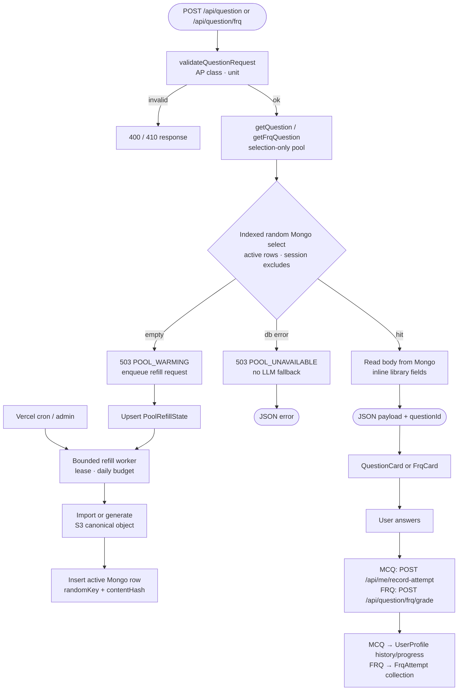
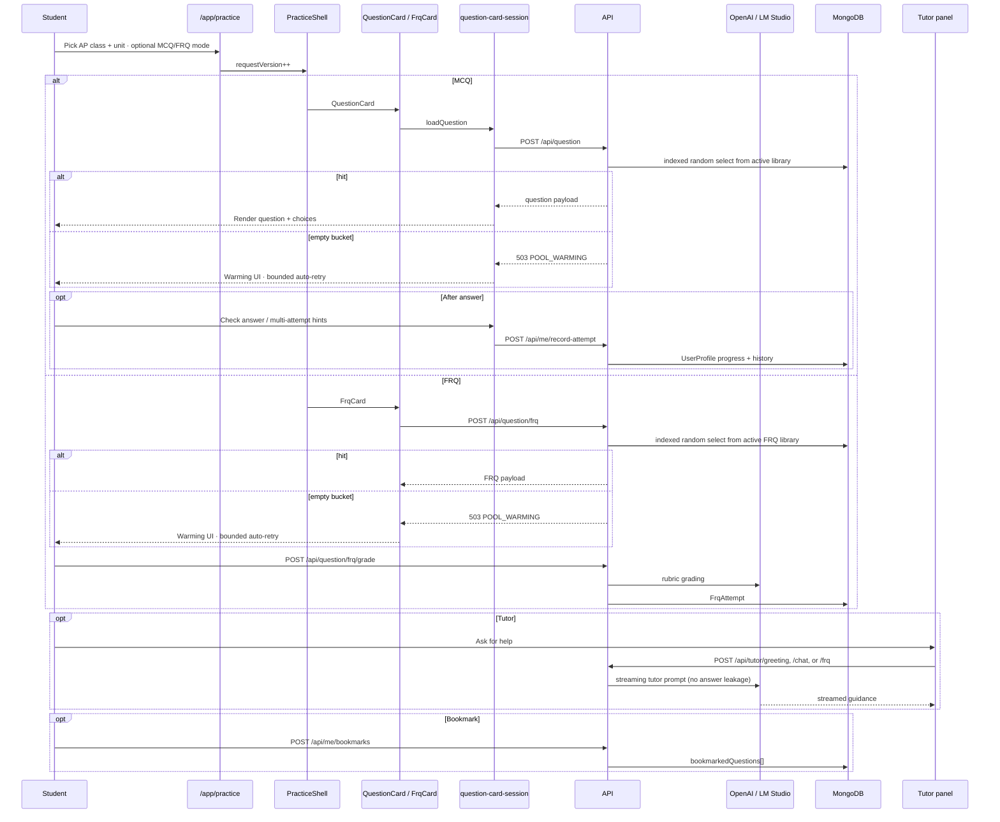

# Free AP Practice — Architecture

High-level overview of how the app is structured, how requests flow, and how the main features connect.

---

## 1. System overview


---

## 2. Request lifecycle (every HTTP request)



`POST /api/question` is the only session-bypass exception. FRQ (`/api/question/frq`), `/api/me/*`, and cron/admin routes still resolve sessions or their own auth helpers.

---

## 3. Route map



Public SEO landings use `QuestionShell` (MCQ-only thin wrapper over `PracticeShell`). Authenticated `/app/practice` uses `PracticeShell` with `allowFrq` when the FRQ flag is on. Admin Pool tab enqueues refill jobs only — it never generates synchronously.

---

## 4. Question pool and generation (core feature)

**Roles**

| Store / path                              | Role                                                                                            |
| ----------------------------------------- | ----------------------------------------------------------------------------------------------- |
| **S3** (`questions/`, `frqs/`)            | Canonical archive and ID source. History/bookmarks keep working even if Mongo rows are retired. |
| **Mongo active library**                  | Serving library: full question bodies inline, indexed random selection per class/unit.          |
| **User request path**                     | Selection only — never calls the LLM, never writes S3, never waits on a generation lock.        |
| **Refill workers** (cron + admin enqueue) | Only place that generates: S3-first write, then insert/upsert an active Mongo row.              |

Targets default to demand-scaled MCQ floors (JSON in `src/lib/data/question-pool-targets.json`: Biology preferred **35**, default preferred **20**, min **10** from generation-stats share) and **8 active FRQs** per class/unit. Refill starts below 90% of target and fills back to target. Targets are **floors, not caps**: buckets already above target are left alone (no auto-trim). Serving does not consume or delete rows.



**Pool behavior notes**

- Signed-in and anonymous users share the same Mongo serving library (per question type).
- The browser sends current-session `excludeQuestionIds` (capped at 100). If every active ID is excluded but the bucket is non-empty, selection resets exclusions and returns a random active question.
- Multiple users can receive the same question at the same time; rows are not claimed or deleted on serve.
- `contentHash` (SHA-256 of normalized question text) deduplicates inserts into the library; duplicate keys during refill are skipped and counted toward the run budget (S3 objects may remain as archive orphans).
- Empty buckets return typed `POOL_WARMING` immediately and request asynchronous population — there is no synchronous generation fallback.
- **Refill leases:** warming/admin enqueue never demotes a live `running` lease to `pending`. The cron worker claims due jobs, renews the lease before each generation, and stops on per-run / daily LLM budget. Full-catalog reconcile (`bun run pool:reconcile` → `reconcilePoolRefillJobs`) is an ops tool — it is **not** run on every cron tick (that N+1 would starve generation inside the serverless time budget).
- Ops: `bun run pool:backfill-s3`, `bun run pool:retire` (replaces the old clear-cache script), `bun run pool:verify-indexes`. See [question-pool-runbook.md](./question-pool-runbook.md).

User-facing `/api/question` has **no** LLM rate limiter because it never calls the LLM. Cost controls live on the refill worker (`QUESTION_POOL_DAILY_LLM_GENERATION_BUDGET` in `src/lib/questions/pool-constants.ts` with atomic reserve, per-run generation cap, leases). Tutor chat remains a separate path.

---

## 5. Authentication and user profile


`POST /api/question` skips `auth.api.getSession` in hooks (public MCQ hot path). FRQ and `/api/me/*` still resolve the session; FRQ also uses `withAuthedHandler`.

Canonical site origin for emails, sitemaps, and discovery lives in `$lib/site-url.ts`. Auth callbacks use `$lib/auth/urls.ts` (`authCallbackUrl`). Authenticated API routes use `withAuthedHandler` in `$lib/auth/route-helpers.server.ts`.

---

## 6. Practice session (signed-in user journey)



Practice serve paths never call the LLM or read S3 for the question body — only Mongo. Generation happens asynchronously via `/api/cron/question-pool` (and admin enqueue). History/bookmark loads still resolve canonical bodies from S3 by `questionId` when needed.

`QuestionShell` is a thin public MCQ-only wrapper around `PracticeShell`. MCQ answer/load/experiment state lives in `createQuestionCardSession` (`question-card-session.svelte.ts`); markup stays in `question-card.svelte`.

`$lib/practice/*` is the **multi-attempt A/B experiment**, not practice routing. Practice page catalog + SEO live in `$lib/catalog` and `$lib/components/practice`.

---

## 7. Data model (MongoDB)

```mermaid
erDiagram
    AUTH_USERS ||--o{ AUTH_SESSIONS : has
    AUTH_USERS ||--o{ AUTH_ACCOUNTS : has
    AUTH_USERS ||--|| USER_PROFILE : "1:1 via userId"
    AUTH_USERS ||--o{ FRQ_ATTEMPT : has
    AUTH_USERS ||--o{ REFERRAL : "referrer or referred"

    USER_PROFILE {
        string userId PK
        array progress
        array questionHistory
        array bookmarkedQuestions
        array practiceExperiments
    }

    FRQ_ATTEMPT {
        string userId
        string questionId
        string status
        object grade
    }

    REFERRAL {
        string referrerUserId
        string referredUserId
        string code
    }

    QUESTION_POOL {
        string s3QuestionId UK
        string apClass
        string unit
        string contentHash UK
        boolean active
        number randomKey
        string question
    }

    POOL_REFILL_STATE {
        string questionType
        string apClass
        string unit
        string status
        number target
        number observedCount
        string leaseOwner
        date leaseExpiresAt
    }

    POOL_GENERATION_BUDGET {
        string dayKey UK
        number generations
    }

    QUESTION_RECENT_TOPICS {
        string apClass
        string unit
        string topicsCovered
    }

    GEN_STATS {
        counters for public /stats
    }

    QUESTION_POOL }o--|| S3_OBJECT : "s3QuestionId from archive/generation"
    USER_PROFILE }o--o{ S3_OBJECT : "history references questionId"
    FRQ_ATTEMPT }o--o{ S3_OBJECT : "FRQ questionId"
    POOL_REFILL_STATE }o--|| QUESTION_POOL : "maintains active counts"
```

---

## How the pieces fit together

| Layer                | Role                                                                                                                                        |
| -------------------- | ------------------------------------------------------------------------------------------------------------------------------------------- |
| **Public site**      | Marketing, blog, SEO practice pages, and generation stats — mostly static or read-only                                                      |
| **/app**             | Core product: MCQ (+ optional FRQ) practice, progress, history, bookmarks, settings                                                         |
| **Question library** | S3 = canonical archive; Mongo = active serving library; refill workers generate; request path is selection-only (`POOL_WARMING` when empty) |
| **Better Auth**      | Sessions, OAuth, email verification; creates `UserProfile` on signup; `deleteAppDataForUsers` cleans app rows on account delete             |
| **AI layer**         | One OpenAI-compatible provider for **worker** generation, FRQ grading, and tutor chat — not for `/api/question` serves                      |
| **Referrals**        | Invite cookie → claim → activate on first meaningful attempt                                                                                |
| **Vercel**           | Hosting, cron refill route, `waitUntil` for background auth tasks, Flags SDK, optional Analytics/Speed Insights                             |

---

## Latency and region co-location

Question pool hits are Mongo-bound. **Vercel serverless functions and MongoDB Atlas must share the same region** (verify in Vercel project settings and the Atlas cluster region). Cross-region RTT shows up as elevated `db_connect_ms` / `pool_query_ms` on `question_request` metrics and cannot be papered over in code.

Operational checks and alert thresholds live in [`docs/question-request-metrics.md`](question-request-metrics.md). Index health: `bun run pool:verify-indexes`. Public MCQ `POST /api/question` skips Better Auth session lookup in `hooks.server.ts` to avoid auth round-trips on the hot path; FRQ and `/api/me/*` retain full session resolution.
