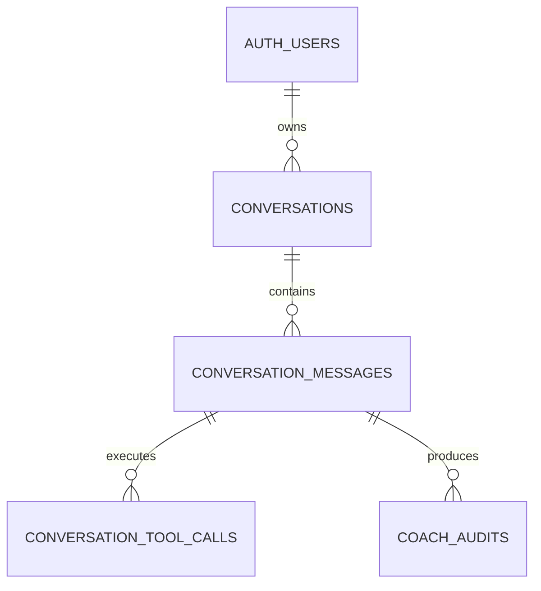

# Coach Conversation Persistence Plan

Status: design only; implementation not started.

## Goal

Persist Coach conversations to Neon so that:

- each conversation belongs to one authenticated user;
- messages retain their order and can be loaded later;
- tool calls and their inputs/outputs belong to the assistant message that produced them;
- the UI can replay tool activity after a page reload;
- Coach approvals and mutation audits can be traced back to a conversation.

## Existing foundation

The repository already contains these tables in `app`:

- `conversations`
- `conversation_messages`

They were added in migration `0001`, but are currently unused by Coach. There is no persisted tool-call table.

## Relationship



## Database design

### `app.conversations`

Reuse the existing table:

- `id text primary key`
- `user_id text not null references auth.users(id) on delete cascade`
- `title text not null`
- `last_message_at timestamptz`
- `created_at timestamptz not null`
- `updated_at timestamptz not null`

The existing `(user_id, updated_at)` index is appropriate for listing recent conversations. Do not add a generic conversation type until Tutor also needs durable conversations.

### `app.conversation_messages`

Keep the existing message columns and add:

- `parts jsonb not null default '[]'`
  - Exact AI SDK UI parts used to replay the message, including text and tool parts.
- `status text not null default 'complete'`
  - Expected values: `streaming`, `complete`, `aborted`, `error`.
- `client_message_id text`
  - Used to make client retries idempotent.
- `updated_at timestamptz not null default now()`

Keep the unique `(conversation_id, position)` constraint. Add checks for valid roles (`user` and `assistant`) and non-negative positions. The server should generate durable message IDs; the client ID is only a deduplication key.

### `app.conversation_tool_calls`

Add a new table:

```text
id              text primary key
message_id      text not null references conversation_messages(id) on delete cascade
tool_call_id    text not null
part_index      integer not null
tool_name       text not null
state           text not null
input           jsonb
output          jsonb
error_text      text
created_at      timestamptz not null
completed_at    timestamptz
```

Add:

- unique `(message_id, tool_call_id)`;
- unique `(message_id, part_index)`;
- index `(message_id, part_index)`.

Do not duplicate `conversation_id` on this table; it is determined through `message_id`.

`conversation_messages.parts` is the exact replay snapshot. `conversation_tool_calls` is the normalized, queryable representation of tool activity and should be written from the same server-generated response.

### `app.coach_audits`

Keep `session_id` for the existing Redis approval/idempotency behavior. Do not use it as the durable conversation ID.

Add nullable foreign keys:

- `conversation_id` → `conversations.id` with `on delete set null`;
- `message_id` → `conversation_messages.id` with `on delete set null`;
- `tool_call_id` → `conversation_tool_calls.id` with `on delete set null`.

Existing audit rows can remain null for these new fields.

## Request and persistence flow

Update `/api/coach` so the server owns conversation history:

1. Validate that the requested conversation belongs to the authenticated user.
2. Load prior messages from Neon.
3. Accept only the new user message from the client; do not trust client-provided assistant/tool history.
4. Persist the user message.
5. Create an assistant message placeholder with `status = 'streaming'`.
6. Run Coach using server-loaded text history.
7. In the AI SDK `onFinish` callback, save the final assistant text and complete `parts` payload.
8. Extract tool parts into `conversation_tool_calls`.
9. Link mutation audits to the conversation/message/tool call where possible.
10. Mark the assistant message complete and update the conversation timestamps.

If the stream aborts or errors, update the placeholder status to `aborted` or `error` so the conversation does not contain an indefinitely streaming message.

System instructions, hidden personalization context, and raw provider request metadata should not be persisted as conversation messages.

## API/UI additions

Add repository functions for creating, listing, loading, appending, finalizing, and deleting owned conversations.

Likely routes:

- `GET /api/coach/conversations`
- `POST /api/coach/conversations`
- `GET /api/coach/conversations/[id]`
- `DELETE /api/coach/conversations/[id]`

The Coach page should use a durable `conversationId`. Keep the existing browser `sessionId` separately for approvals and short-lived idempotency.

When loading history for the model, send only persisted user/assistant text. Tool calls remain available for UI replay and audit history but do not need to be resent as incomplete model tool messages.

## Migration and cleanup work

1. Add the Drizzle schema definitions in `src/lib/server/neon/schema/app.ts`.
2. Generate a new migration; never modify an already-applied migration.
3. Apply it through the existing `bun run db:apply` workflow.
4. Update `delete-app-data-documents.server.ts` to delete conversations explicitly during account cleanup. Message and tool-call rows will cascade.
5. Do not delete Coach conversations from “clear practice data”; conversation history is separate from practice history.
6. Update privacy/settings copy to disclose that Coach conversations are saved to the account.

## Product decision

Coach transcript persistence should be separate from Mem0 long-term memory. The existing `memory_enabled` setting should continue to control memory extraction, not silently control saved chat history. If chat history should be disableable, add a separate explicit conversation-history setting rather than reusing `memory_enabled`.

Before implementation, verify whether the existing `conversations` and `conversation_messages` tables contain any rows so the migration can preserve them safely.
